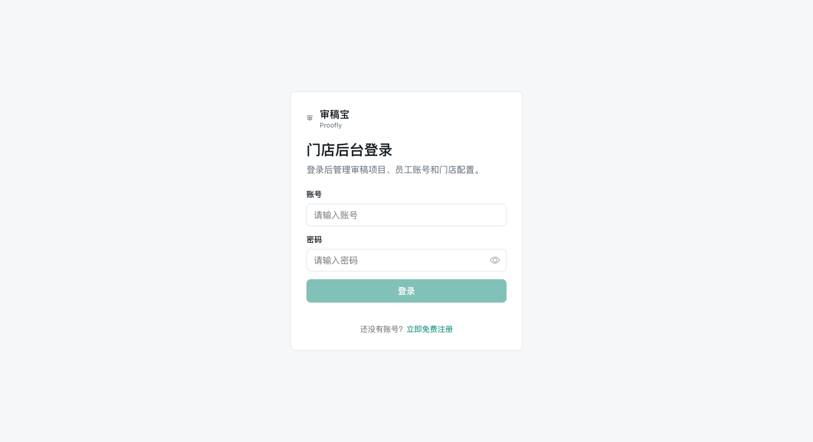
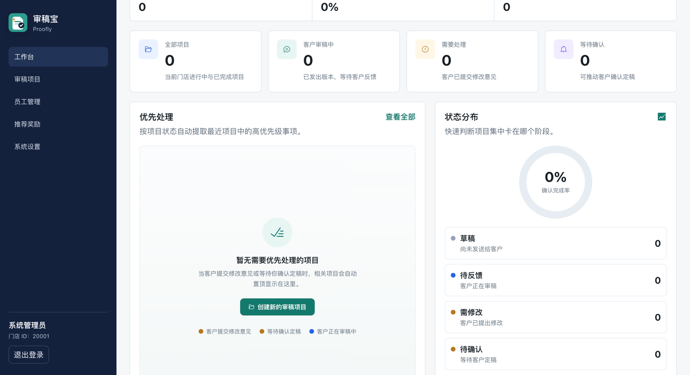
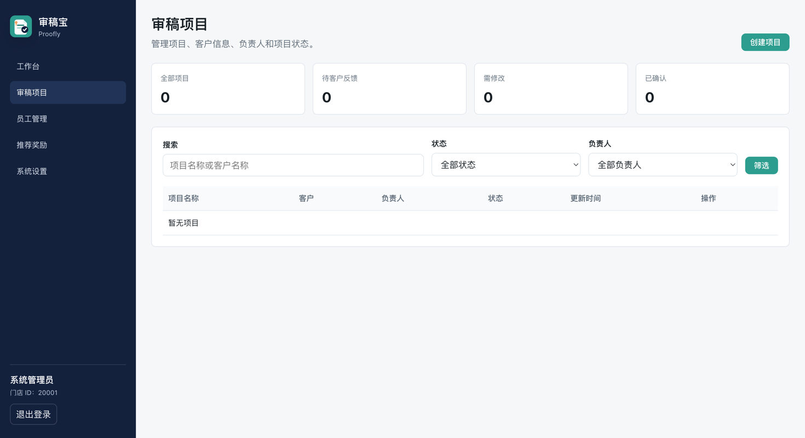
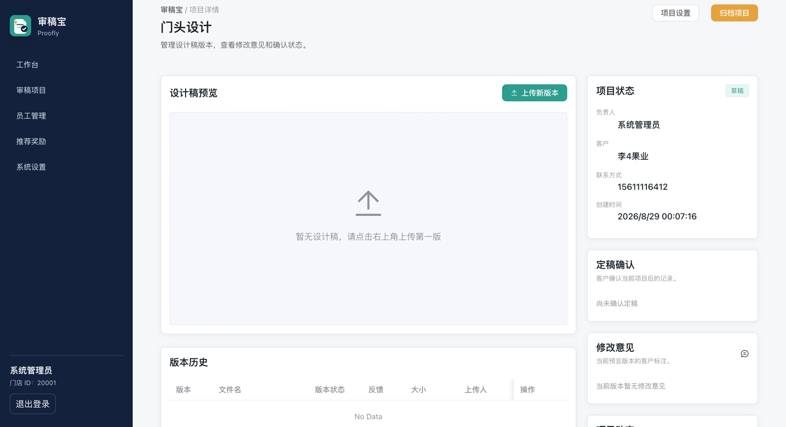
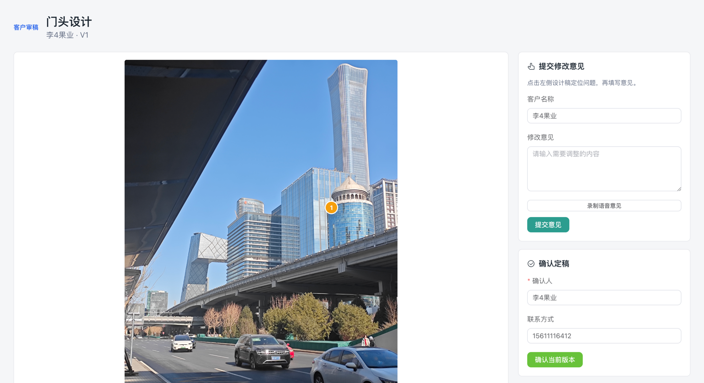
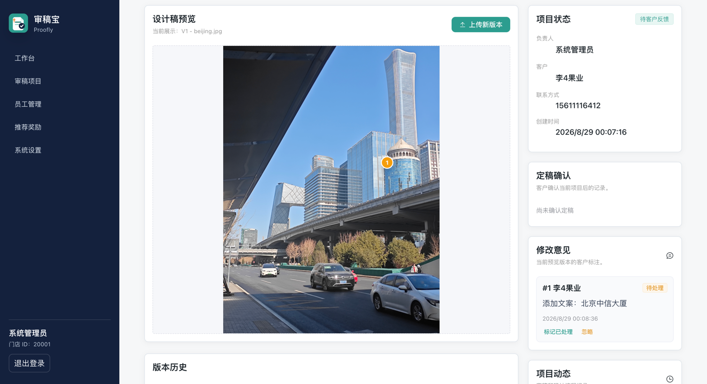

<div align="center">

# 审稿宝（Proofly）

一套面向**广告制作店 / 图文打印店 / 快印店 / 包装印刷店 / 设计工作室**的在线审稿确认系统。

[](LICENSE)
[](https://github.com/liyu-1028/Proofly/releases)


</div>

## 📖 简介

**审稿宝**帮助设计工作室与门店，把传统线下"邮件 / 微信来回发稿"的设计确认流程搬到线上：

```
设计师创建项目 → 上传设计稿 → 生成审稿链接 → 客户标注修改意见
                                          ↓
                              设计师上传新版 → 客户确认定稿
                                          ↓
                              系统保存可追溯确认记录
```

基于 `Vue 3`、`Vite`、`TypeScript`、`Spring Boot 3` 等主流技术构建，开箱即用，也可作为多租户 SaaS 应用的学习参考。

## ✨ 特性

### 门店后台

- **多角色权限** — 门店 / 员工管理，RBAC 三角色（owner / designer / admin）
- **审稿项目** — 完整生命周期：草稿 → 待反馈 → 需修改 → 已确认 → 归档
- **版本管理** — 设计稿自动递增版本号，历史不可覆盖
- **标注处理** — 客户点图标注，设计师按版本逐条处理
- **后台工作台** — 状态看板、最近项目、近期动态
- **套餐订阅** — 模拟 XPay 沙箱支付 + 自动续期 + 到期降级

### 客户审稿（公开链接）

- **免登录访问** — 哈希 Token 链接，泄露可吊销
- **在线标注** — 直接在浏览器中点图提交修改意见，支持语音批注
- **版本切换** — 多版本对比预览，无需下载原图
- **一键确认** — 幂等确认定稿，IP / UA 留痕，自动生成确认记录

### 运营 & 商业化

- **多租户架构** — 所有核心业务表按门店（store）隔离
- **订阅计费** — 月 / 6 月 / 年三档套餐，自动折扣与账单流水
- **用量控制** — 免费版限 3 个活跃项目、1 名员工
- **裂变邀请** — 邀请双方各延长 30 天 Pro 套餐

## 🖼️ 预览

**门店后台登录**



**工作台**



**审稿项目管理**



**项目详情与版本管理**



**客户在线标注与确认定稿（免登录公开链接）**



**修改意见处理**



## 🚀 安装和使用

**环境要求**：JDK 17 · Node.js 18+ · Docker & Docker Compose

1. 获取项目代码

```bash
git clone https://github.com/liyu-1028/Proofly.git
cd Proofly
```

2. 配置环境变量，并生成 RSA 密钥对（必做，否则后端启动失败）

```bash
cp .env.example .env

mkdir -p backend/keys
openssl genpkey -algorithm RSA -out backend/keys/private.pem -pkeyopt rsa_keygen_bits:2048
openssl rsa -in backend/keys/private.pem -pubout -out backend/keys/public.pem
# 将两个 pem 内容（去掉头尾标记、拼成单行）分别填入 .env 的
# PROOFLY_AUTH_RSA_PUBLIC_KEY 和 PROOFLY_AUTH_RSA_PRIVATE_KEY
```

3. 启动基础设施（MySQL / Redis / MinIO）

```bash
docker compose up -d mysql redis minio minio-init

# 等待 MySQL 健康检查通过后，初始化数据库
until docker compose exec -T mysql mysqladmin ping -h localhost -uroot -pproofly_dev --silent; do sleep 2; done
docker compose exec -T mysql mysql -uroot -pproofly_dev < docs/mysql-schema.sql
docker compose exec -T mysql mysql -uroot -pproofly_dev < docs/seed-dev.sql   # 可选：开发种子数据
```

4. 启动后端（Spring 不会自动读取根目录 `.env`，需先导入 shell）

```bash
cd backend
set -a && source ../.env && set +a
mvn spring-boot:run
```

5. 启动前端

```bash
cd frontend
npm install
npm run dev
```

6. 访问 <http://localhost:5173>

Test Account: `admin` / `admin123`（种子数据，仅限本地开发）

> 💡 详细说明见 [docs/quickstart.md](docs/quickstart.md)；IDE 用户可在 Run Configuration 的 Environment variables 中直接粘贴 `.env` 内容。

## 🏗️ 技术栈

| 层级 | 技术 |
|------|------|
| 后端 | JDK 17 · Spring Boot 3.5 · MyBatis-Plus 3.5 |
| 前端 | Vue 3.5 · Vite 6 · TypeScript · Element Plus 2.13 |
| 数据库 | MySQL 8.0 |
| 缓存 | Redis 7.4 |
| 对象存储 | MinIO |
| 认证 | JWT（jjwt 0.13）+ RSA 加密传输 |
| 部署 | Docker Compose · 多阶段构建 |

## 📐 架构

```
┌──────────────────────────────────────────────────────────┐
│                      前端 (Vue 3)                        │
│  门店后台 SPA ──┬── 客户公开审稿页 (免登录 Token)         │
└────────┬────────┴───────────────────────┬───────────────┘
         │ /api/admin/** (JWT)            │ /api/public/** (Token)
┌────────▼────────────────────────────────▼───────────────┐
│                  后端 (Spring Boot 3)                    │
│  Controller → Service → DAO → MyBatis-Plus → MySQL       │
│  ├─ 鉴权 (JWT + Redis + RSA)                             │
│  ├─ 存储 (MinIO 预签名 URL)                              │
│  └─ 定时任务 (套餐到期扫描)                              │
└────────┬──────────────────┬──────────────┬──────────────┘
    ┌────▼─────┐      ┌─────▼─────┐   ┌────▼─────┐
    │  MySQL   │      │   Redis   │   │  MinIO   │
    └──────────┘      └───────────┘   └──────────┘
```

## 📦 模块清单

| 模块 | 状态 | 说明 |
|------|:----:|------|
| M01 账号、门店与权限 | ✅ | RBAC + JWT |
| M02 审稿项目 | ✅ | 项目生命周期 |
| M03 设计稿版本 | ✅ | 自动递增，历史不可覆盖 |
| M04 文件上传与存储 | ✅ | MinIO 预签名预览 |
| M05 客户审稿链接 | ✅ | 哈希 Token |
| M06 在线标注评论 | ✅ | 含语音批注 |
| M07 客户确认定稿 | ✅ | 幂等确认 |
| M08 审稿行为与确认记录 | ✅ | 审计日志 |
| M09 后台工作台 | ✅ | 状态看板 |
| M10 通知与提醒 | ✅ | 站内通知 |
| M11 系统配置 | ✅ | 品牌定制 |
| M12 部署运维 | 🔄 | 云原生方案设计中 |
| M13 套餐、用量与账单 | ✅ | 模拟 XPay + Webhook |
| M14 AI 辅助能力 | ⏸️ | 待规划 |

## 📝 更新日志

[CHANGELOG](CHANGELOG.md)

## 🤝 如何贡献

非常欢迎加入！请先阅读 [CONTRIBUTING.md](CONTRIBUTING.md)，或直接 [提交 Issue](https://github.com/liyu-1028/Proofly/issues/new/choose)。

**Pull Request 流程：**

1. Fork 本仓库
2. 创建你的分支：`git checkout -b feat/xxxx`
3. 提交变更：`git commit -am 'feat(function): add xxxxx'`
4. 推送分支：`git push origin feat/xxxx`
5. 发起 Pull Request

## 📌 Git 提交规范

参考 [Angular](https://github.com/conventional-changelog/conventional-changelog/tree/master/packages/conventional-changelog-angular) 提交规范：

- `feat` 新功能
- `fix` 修复问题 / BUG
- `style` 代码风格相关，不影响运行结果
- `perf` 性能优化
- `refactor` 重构
- `revert` 撤销修改
- `test` 测试相关
- `docs` 文档 / 注释
- `chore` 依赖更新 / 脚手架配置修改等
- `ci` 持续集成
- `types` 类型定义文件变更

## 🌐 浏览器支持

支持现代浏览器（Chrome / Edge / Firefox / Safari 最新两个大版本），不支持 IE。

## 📜 安全

发现安全漏洞？请阅读 [SECURITY.md](SECURITY.md) 反馈，**不要**在公开 Issue 中披露。

## ⚖️ 许可证

本项目基于 [GPL-3.0](LICENSE) 许可证开源 — 你可以自由使用、修改、分发，但任何衍生作品也必须以 GPL-3.0 开源。

## 🙏 致谢

- 受一位实习同事 [Jmiao11](https://github.com/Jmiao11) 的推动，把这个沉积在我目录中多个月的项目整理开源出来了，希望能帮到有需要的小伙伴
- [Vue Vben Admin](https://github.com/vbenjs/vue-vben-admin) — README 模板参考
- [Element Plus](https://element-plus.org/) — Vue 3 组件库
- [Spring Boot](https://spring.io/projects/spring-boot) — 后端框架
- [MyBatis-Plus](https://baomidou.com/) — 持久层增强
- [MinIO](https://min.io/) / [Redis](https://redis.io/) — 存储与缓存

---

Made with ❤️ by Proofly Contributors
